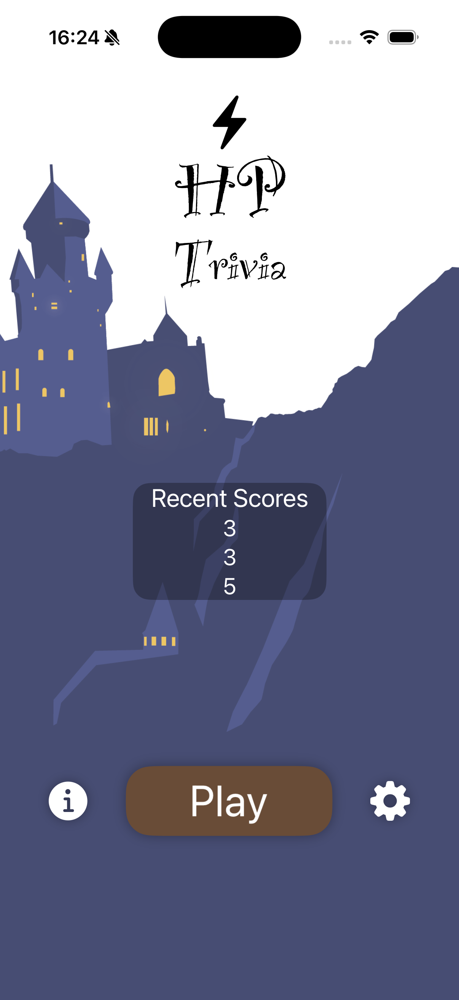
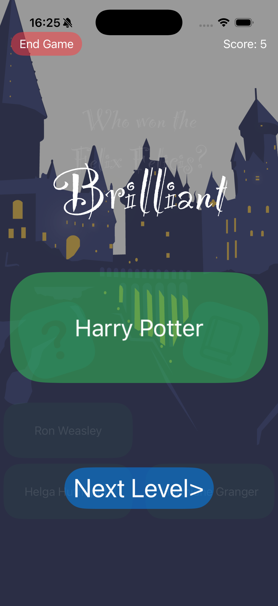
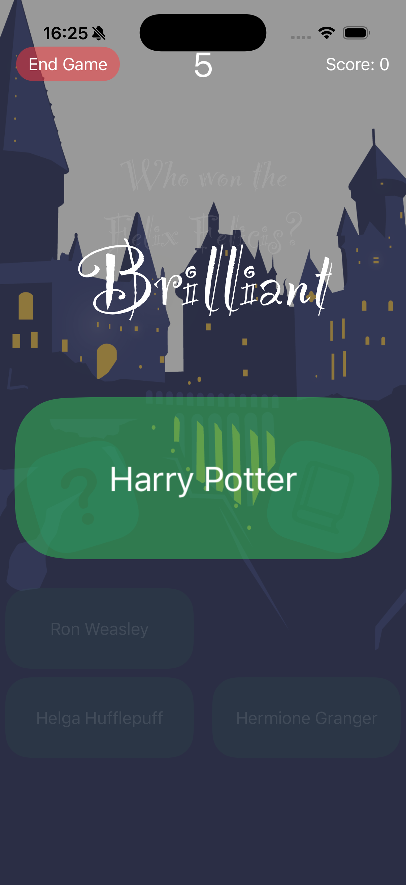
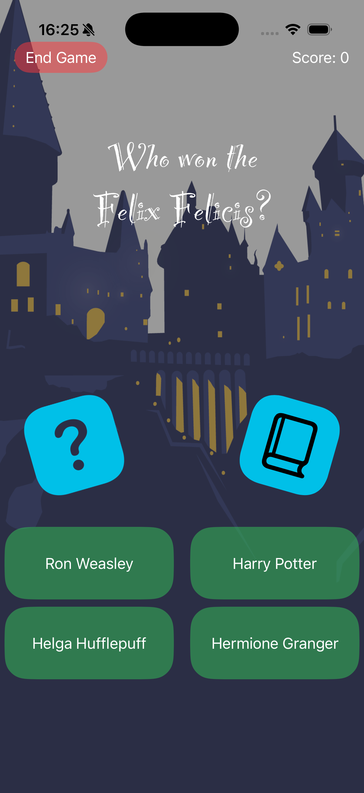

# Harry Potter Trivia App 📱

[](https://swift.org)
[](https://apple.com/ios)

This is Harry Potter Trivia App, a gaming project that asks your questions and look for your best comprehensive information about all Wizard World.

## 📸 Screenshots

### Highlights
| Main Screen | How to Play | Gameplay |
|:---:|:---:|:---:|
|  |  |  |

### Complete Gallery
Here you can see the app in action:

<p align="left">
  
  
  
</p>

> [!TIP]
> 

## ✨ Features

- [x] Magical Trivia Experience: Test your Harry Potter knowledge with a dynamic quiz system.
- [x] Immersive Audio: Integrated sound effects and background music using AVKit for a full Hogwarts atmosphere.
- [x] Interactive Gameplay: Engaging animations and transitions powered by SwiftUI.
- [x] Store Integration: Support for in-app features or feedback prompts using StoreKit.
- [x] Persistent Progress: Tracking your scores and game state throughout the magical journey.

## 🛠 Technologies and Tools

- **Language:** Swift 6.0
- **Interface:** SwiftUI
- **Architeture:** SwiftUI State Management / MVVM
- **FrameWork:** AVKit, StoreKit, Foundation

## 🚀 How to run the project

1. Clone Repository:
   ```bash
   git clone https://github.com/keykenzo/HPTrivia.git
